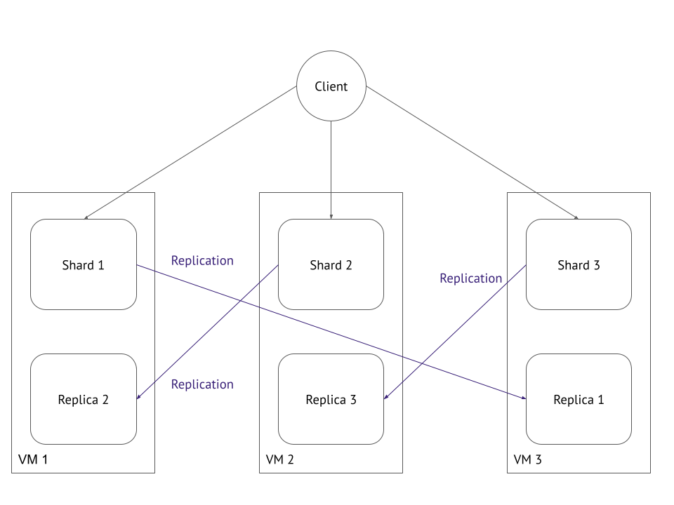

# microservices-04
                                "Микросервисы: Масштабирование"

Задача 1: Кластеризация
Предложите решение для обеспечения развёртывания, запуска и управления приложениями. Решение может состоять из одного или нескольких программных продуктов и должно описывать способы и принципы их взаимодействия.

Общий стек решения: Kubernetes + Istio Service Mesh.

> Вопрос: -->>: поддержка контейнеров;

Решение:  
Kubernetes — оркестратор контейнеров. Управляющие компоненты (kube-apiserver, etcd, controller-manager, scheduler) хранят желаемое состояние кластера и принимают решения о размещении Pods, на которых исполняются контейнеры.

Обоснование:  
Роль контейнеризации и автоматического масштабирования в контейнерных средах (приведены на слайдах 29–35). В частности, на слайд 34 прямо перечислены Kubernetes-инструменты автомасштабирования, что подтверждает использование Kubernetes как контейнерной платформы.

Вывод:  
Kubernetes — индустриальный стандарт оркестрации контейнеризированных микросервисов.

> Вопрос: -->>: обеспечивать обнаружение сервисов и маршрутизацию запросов;

Решение:  
Базовое обнаружение — CoreDNS в Kubernetes (Service → ClusterIP). Расширенное — Istio Service Mesh с sidecar-прокси Envoy.  Они динамически получают конфигурацию маршрутизации через xDS API. 
Istio позволяет настраивать L7-маршрутизацию, и балансировку, повторные попытки и таймауты с помощью ресурсов VirtualService и DestinationRule.

Обоснование:  
На слайде 45: «Service Mesh позволяет решить проблемы Service Discovery в контейнерных средах». Istio как ведущая реализация Service Mesh упоминается на слайдах 43–44. Подходы к Service Discovery (DNS, Service Registry) обсуждаются на слайдах 38–41.

Вывод:  
Связка Kubernetes DNS + Istio реализует полный цикл обнаружения и интеллектуальной маршрутизации, необходимый для микросервисов.

> Вопрос: -->>: обеспечивать возможность горизонтального масштабирования;

Решение:  
Kubernetes масштабирует сервисы изменением числа реплик в Deployment / ReplicaSet. Istio обеспечивает балансировку трафика между экземплярами сервиса (round-robin, least-conn и др.).

Обоснование:  
Горизонтальное масштабирование — это ось X Scale Cube, описанная на слайде 3. Лекция рассматривает балансировщики как способ распределения нагрузки по нескольким серверам (слайд 15) и системы обработки задач с конкурентными обработчиками (слайд 17).

Вывод:  
Kubernetes нативно поддерживает горизонтальное масштабирование, а Istio превращает его в прозрачную для приложений балансировку.

> Вопрос: -->>: обеспечивать возможность автоматического масштабирования;

Решение:  
Используется Kubernetes Horizontal Pod Autoscaler (HPA) на основе метрик CPU/памяти из Metrics Server, а также кастомных метрик из Prometheus (через адаптер). При нехватке ресурсов включается Cluster Autoscaler, добавляющий узлы.

Обоснование:  
На слайде 34 «Kubernetes Horizontal Pod Autoscaler» явно назван в числе инструментов автомасштабирования. Подходы к масштабированию на основе метрик приложения/инфраструктуры (CPU, количество запросов, длительность обработки) детализируются на слайде 33.

Вывод:  
Kubernetes HPA полностью реализует динамическое автомасштабирование по метрикам, соответствующее принципам лекции.

> Вопрос: -->>: обеспечивать явное разделение ресурсов, доступных извне и внутри системы;

Решение:  
Внешние запросы принимаются только через Istio Ingress Gateway. Внутренние сервисы имеют тип ClusterIP и недоступны снаружи. Сетевая микросегментация задаётся через Kubernetes NetworkPolicy и Istio AuthorizationPolicy, весь межсервисный трафик шифруется по mTLS.

Обоснование:  
В списке задач Service Mesh (слайд 42) отмечено: «повышение безопасности: отсутствие риска перехвата трафика, полный контроль над сетью, исключение угроз при работе в нескольких дата-центрах». Эти возможности обеспечиваются политиками Istio.

Вывод:  
Комбинация Istio и NetworkPolicy гарантирует изоляцию внешнего и внутреннего трафика и полный контроль над сетевыми взаимодействиями.

> Вопрос: -->>: обеспечивать возможность конфигурировать приложения с помощью переменных среды, в том числе с возможностью безопасного хранения чувствительных данных таких как пароли, ключи доступа, ключи шифрования и т.п.;

Решение:  
Kubernetes ConfigMap предоставляет конфигурацию в виде переменных окружения или файлов. Kubernetes Secrets хранят пароли, ключи доступа и шифрования. Secrets могут быть зашифрованы в etcd, а Istio может автоматически монтировать TLS-сертификаты из секретов.

Обоснование:  
Лекция не фокусируется на этом отдельно, но ConfigMap и Secrets — базовые примитивы Kubernetes, обеспечивающие стандартный способ внешней конфигурации двенадцатифакторных приложений и безопасное хранение чувствительных данных.

Вывод:  
Kubernetes изначально предоставляет механизмы управления конфигурацией и секретами, покрывая потребности любого микросервиса.

Итоговый вывод:  
Стек Kubernetes + Istio полностью соответствует всем предъявленным требованиям, опирается на концепции, изложенные в лекции (Scale Cube, балансировка, автомасштабирование, Service Discovery и Service Mesh), и обеспечивает промышленную платформу для развёртывания, управления и безопасной эксплуатации микросервисов.

Ниже представлено решение задачи 2 в формате «Вопрос – Решение – Обоснование – Вывод». Изложение опирается на концепции кеширования из лекции, но подаётся строгим научным языком и без прямых ссылок на слайды.

---

Задача 2: Распределённый кеш * (необязательная)
Разработчикам вашей компании понадобился распределённый кеш для организации хранения временной информации по сессиям пользователей. Вам необходимо построить Redis Cluster, состоящий из трёх шард с тремя репликами.

Схема:  

> Вопрос: -->>: требуется распределённый кеш для хранения временной информации о сессиях пользователей, реализованный как Redis Cluster из трёх шард, каждая из которых имеет реплику.

Решение:
Развёртывается Redis Cluster, включающий шесть узлов: три мастер-ноды (шарды) и три реплики (по одной на каждую шарду). Каждый узел размещается на обособленной виртуальной машине для обеспечения отказоустойчивости на уровне аппаратного окружения. Данные распределяются по мастерам с помощью механизма хеш-слотов (16384 слота). Реплики постоянно асинхронно синхронизируются с соответствующими мастерами. В случае отказа мастер-ноды её реплика автоматически повышается до роли мастера, используя внутренние протоколы обнаружения сбоев и выбора лидера, встроенные в кластер Redis. Клиентские библиотеки, поддерживающие кластерный режим, напрямую обращаются к нужному мастеру, а при необходимости редиректа – обрабатывают сигнал `MOVED`.

Обоснование:  
Кеширование – один из фундаментальных методов повышения производительности микросервисных систем, позволяющий избежать многократного обращения к медленным источникам данных. Хранение данных в оперативной памяти гарантирует минимальные задержки. Шардирование даёт возможность линейного наращивания ёмкости и пропускной способности кластера простым добавлением новых мастеров. Наличие реплик решает одновременно две задачи: во-первых, обеспечивает сохранность данных при сбое оборудования, во-вторых, позволяет масштабировать нагрузку на чтение за счёт чтения с реплик, если это допустимо для согласованности данных сессий. Выбор Redis в качестве реализации опирается на то, что он является In-Memory хранилищем, специально предназначенным для сценариев распределённого кеша. Принципы, заложенные в архитектуре Redis Cluster, согласуются с обсуждаемой в лекции концепцией распределённого кеша, где данные разделены по узлам, а каждый узел может иметь реплику для отказоустойчивости.

Вывод:  
Redis Cluster из трёх шард с тремя репликами полностью удовлетворяет предъявленным требованиям по производительности, горизонтальному масштабированию и отказоустойчивости, что подтверждается как общепринятой инженерной практикой, так и рассмотренными в лекции подходами к кешированию.

Спасибо, интересные технологии.
С уважением Виктор.